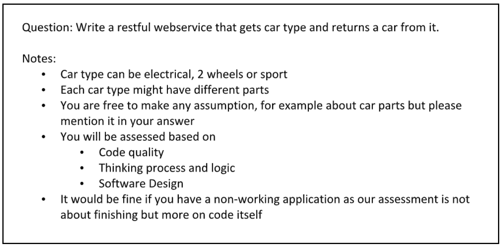

# Fino Cars Service

[](https://github.com/naeemark/fino-cars-service/actions/workflows/publish.yml)
[](https://github.com/naeemark/fino-cars-service/actions/workflows/develop.yml)
[](https://sonarcloud.io/dashboard?id=naeemark_fino-cars-service)
[](https://sonarcloud.io/dashboard?id=naeemark_fino-cars-service)
[](https://img.shields.io/docker/automated/naeemark/fino-cars-service)

Demonstration of Requirements understanding, proposing a solution and implementation by using the latest tools and techniques.

---

- [Distribution](#distribution)
  - [What is this repository for](#what-is-this-repository-for)
- [Problem Statement](#problem-statement)
- [Proposed Solution](#proposed-solution)
- [Entities](#entities)
- [Assumptions](#assumptions)
- [Deliverable Content](#deliverable-content)
- [Deliverable Content](#deliverable-content)
  - [Functional Implementation](#functional-implementation)
  - [Non-Functional Implementation](#non-functional-implementation)
- [Development Cycle](#development-cycle)
- [How to Setup](#how-do-i-get-set-up)
  - **[<< Docker Compose >>](#-docker-compose-)**
  - [Developer Setup](#developer-set-up)
  - [Configuration](#configuration)
    - [Docker Build](#build-docker-image)
    - [Docker Run](#run-docker-image)
    - [Docker Run from Registry](#run-docker-image-from-docker-hub)
    - [Docker Stop](#stop-docker-container)
- [Pre-reqs](#pre-reqs)
- [Tools Included](#tools-included)
- [External Tools](#external-tools)
- [Deployments](#deployment)
- [Contribute](#contribution-guidelines)
- [data-details](#data-details)

---

## Distribution

- **[Swagger API Docs - Deployed on EC2 Instance](http://ec2-54-93-103-83.eu-central-1.compute.amazonaws.com:8080/swagger-ui.html)** - **Bonus Requirement**
- A [docker repository](https://hub.docker.com/repository/docker/naeemark/fino-cars-service/general) is created, the latest image can be downloaded
- **[Sonar Project](https://sonarcloud.io/dashboard?id=naeemark_fino-cars-service)** - **Bonus Requirement**
- **[Docker Compose](docker-compose.yaml)** - **Bonus Requirement**
- [CI/ CD](.github/workflows)
- [Postman Collection Link](https://www.dropbox.com/s/850hqnavv45rrhw/Fino%20cars%20Service.postman_collection.json?dl=0)

---

### What is this repository for?

- This app is built as assignment for FinologyGroup.
- Adds different libs to enhance the application quality and performance.
- Using [SWAGGER.IO](www.swagger.io) for documentation and as a working REST-API client
- CI/CD Demonstration using [Github Actions](https://github.com/features/actions)
- Docker containers are used for Build Deployment
- The live environment is established on an EC2 instance to run dockerized build
- Version 1.0.0

---

### Problem Statement



---

### Proposed Solution:

- For the implementation of REST API, I would prefer to use a [Spring Boot](https://www.tutorialspoint.com/spring_boot/spring_boot_introduction.htm) application for the implementation of required functionality.
- Postgres Database will be used for Persistence.
- For testing, I would prefer to use JUnit and Mockito
- There will be a Dockrized Build distribution
- Some opensource database can be used for mocking purposes.
- As we are mocking an inventory system, there should be a search mechanism available.
- There shouldn't be a possibility to modify the database via JPA
- For demonstration purpose, an API frontend should be provided...i.e Swagger

#### Entities

- I am assuming that there will be only one table in the database which will contain the data (for the sake of simplicity)

<br >

### Assumptions

- The system is for abstraction and demo purpose, so;
  - No auth system is integrated
  - No integration testing is being done in pipelines
  - The code quality checks are place and coverage report is synced in [SonarQube](https://sonarcloud.io/dashboard?id=naeemark_fino-cars-service)
- The is no locking system is implemented on database.

### Deliverable Content

- **GET** `{baseURL}/api/cars` - Retrives total cars available as a single list (Raw implementation)
- **GET** `{baseURL}/api/cars/page?number=1&size=10` - Paginated variation of the listing API
- **GET** `{baseURL}/api/cars/search?id=10` - this will provide a flexibility to search in the database based on different parameters i.e [data-details](#data-details)
- **GET** `{baseURL}/api/health` - Checks the health of the system,

### Development Cycle

- Distributes the whole development into Small tasks
- [Each Issue](https://github.com/naeemark/fino-cars-service/issues?q=is%3Aissue) shows a feature
- [Each commit](https://github.com/naeemark/fino-cars-service/commits/main) shows a small progress
- [Pull Requests](https://github.com/naeemark/fino-cars-service/pulls?q=is%3Apr+is%3Aclosed) are done for major tasks

## How do I get set up

### << Docker Compose >>

To run the project locally using docker;

- `docker compose up --detach --wait`

To tear down:

- `docker compose down --remove-orphans`

### Developer set up

To setup the project locally you need to clone this repo, from `main` branch or some latest `TAG`

### Configuration

- Please sync and resolve the `maven` dependencies
- Run `mvn clean install`
- To run tests `mvn clean test`

##### Build Docker Image

- `docker build -t fino-cars-service .`

<br >

##### Run Docker Image

- Run `docker run -d -p 80:8080 fino-cars-service`
- You may access the running docker app on [`http://localhost/swagger-ui.html`](http://localhost/swagger-ui.html)

##### Run Docker Image From Docker hub

- **[Docker Image Repository](https://hub.docker.com/repository/docker/naeemark/fino-cars-service)**
- Run `docker run -d --name fino-cars-service -p 80:8080 naeemark/fino-cars-service`
- You may access the running docker app on [`http://localhost/swagger-ui.html`](http://localhost/swagger-ui.html)

##### Stop Docker Container

- Run `docker kill {container-id}`

### Pre-reqs

- JDK 1.8
- Spring Boot
- Docker
- PostgreSQL
- Junit
- Mockito
- Swagger
- IntelliJ IDEA

### Tools Included

- Jacoco
- Sonar
- Swagger
- JPA
- Hibernate
- Github Actions
- EC2 Instance for deployment

#### Auth

- No auth system is included in this solution

## External Tools:

- **[Github Actions](https://github.com/features/actions)**
- **[Docker](https://www.docker.com/)**
- **[SonarCould](https://sonarcloud.io/)**

<br >

## Deployment

- When a `pull request` is merged in `master`, `Github Action` starts and following steps are done by automated CI/CD:
  - Creates Environment and Runs all tests
  - Complete a SonarQube analysis and pushes the results to **[Live Project](https://sonarcloud.io/dashboard?branch=develop&id=naeemark_fino-cars-service)**
  - Makes a deployment to Github packages (Mock)
  - Creates the Docker Image and pushes to [Docker Repository](https://hub.docker.com/repository/registry-1.docker.io/naeemark/fino-cars-service)

_As a next step, it is deployed manually in an ec2 instance._

## Contribution guidelines

- Forks are always appreciated

---

#### Data Details

Available Search Params:

```agsl
type: [Micro, Car, Sports, 4 WD, Electrical, Vintage, Coupe, Antique, Hybrid, Crossover, Convertible, Diesel, Classic, Minivan, Wagon, Supercar, MPV, Mini, 2 WD]

year: [2009, 2010, 2011, 2012]

make: [Chrysler, Toyota, BMW Motorrad, GMC, Mercedes-AMG, Maybach, Lincoln, Honda, Grand Cherokee, Ford, Scion, Maserati, Dodge, Chevrolet, Infiniti, MINI, Bentley, Porsche, Audi, Mercedes, Rolls-Royce, Jaguar, Lexus, Lotus, Kia, Lamborghini, Mercedes-Benz, Land Rover, Jeep, Volvo, Buick, Cadillac, Acura, Nissan, Saab, Hyundai, Suzuki, Mitsubishi, Aston Martin, Subaru, Mazda, BMW, Volkswagen, Mercury]
```

---
